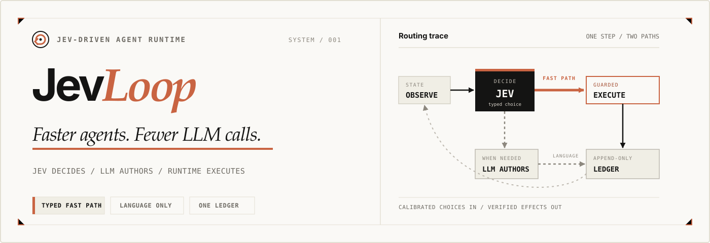
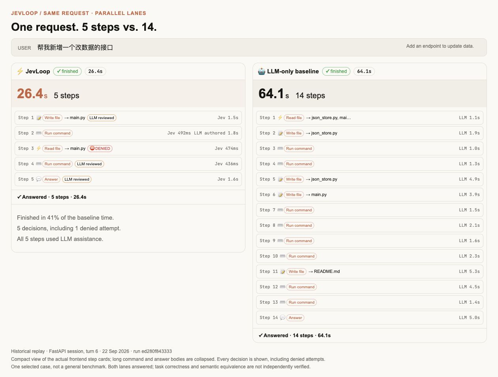
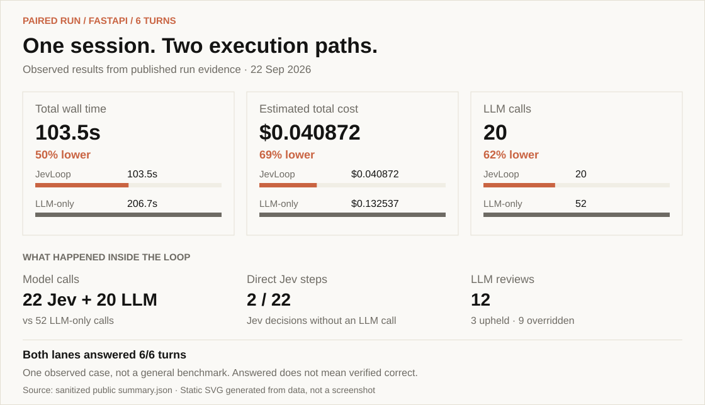

<div align="center">

<!-- HERO_IMAGE_START -->

<!-- HERO_IMAGE_END -->

<p>
  <a href="README.md">English</a> ·
  <a href="README.zh-CN.md">简体中文</a>
</p>

<p>
  <a href="https://www.python.org/"></a>
  <a href="LICENSE"></a>
  <a href="#status"></a>
</p>

</div>

JevLoop is an open-source agent runtime powered by
[TypeSafe Jev](https://docs.typesafe.ai/introduction). Jev handles fast,
calibrated tool decisions; an LLM authors language only when needed and reviews
low-confidence choices; deterministic code owns execution, safety, durability,
and state.

```text
observe → Jev decide ───────────────→ guard → execute → ledger → repeat
                  ├─ needs language → LLM author ───────┘
                  └─ low confidence → LLM review ───────┘
```

The result is a conventional tool-using agent with a fast path: bounded choices
avoid full LLM calls, while authored content still comes from an LLM with the
complete conversation transcript and provider prompt-cache continuity.

JevLoop is an independent open-source project. It is powered by Jev but is not
an official TypeSafe product.

## The same request, two agent loops

“Add an endpoint to update data.” In this historical paired run, JevLoop reached
its answer in **26.4s / 5 steps**, versus **64.1s / 14 steps** for the LLM-only
agent. Both lanes received the same request and execution profile, with separate
workspaces and transcripts.



Compact historical replay using the actual frontend step cards; long command
and answer bodies are hidden. No steps are omitted. All five JevLoop steps used
LLM assistance; fewer steps here does not mean LLM-free execution. This is one
selected turn, not a general performance or correctness claim.
[Run evidence and capture notes →](docs/assets/README.md)

## A measured fast path

> One manually driven six-turn FastAPI case. Both lanes answered every turn;
> this is a scoped observation, not a general benchmark.



Generated from [public run data](docs/evidence/fastapi-6turn-20260922/summary.json)
using the dashboard's color palette. This is a static data visualization, not a live dashboard.

[Full metrics, method, limitations, pricing, and run evidence →](docs/fastapi-case-study.md#english)
· [Regenerate the panels](docs/assets/README.md#summary-panels)

## Why JevLoop

Traditional agent loops ask a general-purpose LLM to make every decision,
including repetitive choices such as which tool to call or which known resource
to open. JevLoop separates that work by type:

- **Jev decides** operations and compatible targets through typed, validated
  probability distributions.
- **An LLM writes** commands, queries, messages, documents, files, and final
  answers only when an action needs authored text.
- **An LLM reviews** low-confidence Jev decisions on the same append-only
  transcript.
- **The runtime executes** every effect through shared budgets, policies,
  idempotency, repeat guards, and sandbox boundaries.
- **The ledger remembers** the verbatim LLM-visible conversation; Jev receives a
  compact projection rebuilt from that ledger.

This architecture is designed to reduce model latency and cost when Jev can
complete a meaningful share of steps directly. JevLoop does not claim every
workload is cheaper: the built-in paired benchmark makes authored-heavy and
navigation-heavy tradeoffs visible instead of hiding them in one aggregate.

## Core design

### One request, parallel typed decisions

Mounted `ToolSpec` declarations compile into one Jev request containing an
operation question and speculative target questions. Code consumes only the
target head compatible with the selected operation. Invalid or incomplete
probability distributions fail before execution.

### One ledger, two views

The LLM reads the complete `Transcript`. Jev reads a bounded `Workspace`
projection containing known resources, recent observations, and recent actions.
Only the transcript is persisted; workspace state is recoverable.

### One runtime for every driver

`JevDriver` and `PlainLlmDriver` return one proposal to the same
`RuntimeKernel`. Drivers cannot execute tools, spend budgets, or mutate state.
The kernel exclusively owns materialization, guardrails, durable intent/effect
records, dispatch, and terminal status.

### Observable comparison

`paired_shadow` runs JevLoop and a plain LLM loop over the same goal, tool
catalog, policy, budgets, and immutable sandbox image. Each lane gets its own
transcript, Docker workspace, and prompt-cache namespace. Metrics separate:

- Jev decisions and input cost;
- direct Jev steps that avoided an LLM call;
- LLM authoring, arbitration, and plain-decision calls;
- provider-reported cache hits, misses, and unknown input;
- latency, tool activity, outcomes, and total estimated cost.

No counterfactual savings are fabricated from one lane; the dashboard compares
actual paired executions and their terminal outcomes.


## Paired benchmark

Run the fixed multi-turn scenario suite:

```bash
make bench
# or: cd backend && uv run jevloop bench
```

Reports are written to `backend/artifacts/bench/<stamp>/report.{json,md}`. The
suite records its digest, model identities, machine-checked expectations,
routing split, cache-aware cost, wall-clock time, and observed advantage. Runs
also appear in the dashboard history unless `--no-journal` is used.

Useful options:

```bash
uv run jevloop bench --list
uv run jevloop bench --only <scenario-id>
uv run jevloop bench --keep-volumes
uv run jevloop bench --no-journal
```

## Execution profiles

| Profile | Lanes | Sandbox effects | Lark writes |
| --- | --- | --- | --- |
| `single_shadow` | JevLoop | Executed | Dry-run |
| `single_live` | JevLoop | Executed | Executed after guardrails |
| `paired_shadow` | JevLoop + plain LLM | Executed in isolated workspaces | Dry-run in both lanes |

Paired live writes are intentionally not representable. `max_writes` is an
optional emergency cap for external mutations; sandbox-local `WRITE_FILE` and
`BASH` are bounded by `max_steps` instead.

## Safety model

- Docker containers run as a non-root user with dropped capabilities,
  `no-new-privileges`, a read-only root filesystem, resource limits, and no host
  secrets or sockets.
- External writes are fail-closed and pass confidence policy, recipient
  allowlists, and budgets before dispatch.
- Materialized intents are durably recorded before execution; effects are
  recorded afterward with explicit disposition.
- Bash source enters the container over stdin and runs in a command-scoped
  process group. A failed command remains explicit `UNKNOWN` evidence, but a
  confirmed-ended command in a responsive sandbox does not permanently freeze
  later turns.
- Repeated identical intents are refused only after identical observations show
  no progress.
- Paired lanes use independent transcripts, workspaces, and provider-cache
  namespaces.

Current limitation: an interrupted run with `dispatch_started` but no effect is
visible in the audit log but is not automatically reconciled after restart.

## Quick start

### Requirements

- Python 3.12+
- [uv](https://docs.astral.sh/uv/)
- Docker
- Node.js and pnpm for the dashboard

File and Bash tools execute inside hardened containers. The host filesystem,
credentials, home directory, environment variables, and sockets are never
mounted into the agent workspace.

### Offline smoke

The smoke path needs Docker but no model API keys:

```bash
cd backend
uv sync
uv run jevloop smoke
```

A successful run prints JSON containing `"ok": true` after exercising the
shared kernel, durable lifecycle, file write/read, Bash, and container cleanup.

### Configure models

```bash
cd backend
cp env.example .env
# Set TYPESAFE_API_KEY and DEEPSEEK_API_KEY.
```

Optional Feishu/Lark tools use the current `lark-cli` user identity:

```bash
lark-cli auth login --domain im,docs
```

### Run one goal

```bash
uv run jevloop run \
  "Create smoke.md containing hello, read it back, then answer done."
```

Lark writes remain dry-run unless `--live` is supplied. Sandbox file and Bash
operations execute for real inside the isolated container. Normal runs allow
container egress; add `--offline-sandbox` for deterministic `--network none`.

### Start the dashboard

```bash
cd ..
pnpm install
pnpm build:frontend
pnpm serve
# http://127.0.0.1:8790
```

For development:

```bash
make dev
```

The dashboard provides chat, per-step model-call traces, Jev-vs-LLM comparison,
session aggregates, pause/continue controls, and replay from persisted JSONL
runs without new API calls.

## Repository layout

```text
backend/   Python runtime, drivers, question compiler, ledger, guardrails,
           Docker sandbox, Lark adapter, benchmark runner, and dashboard API
frontend/  React 19 + TypeScript + Vite dashboard
           chat, comparison, metrics, session history, and replay
docs/      Design of record, invariants, migration plan, and acceptance criteria
```

Start with:

- [`backend/jevloop/kernel.py`](backend/jevloop/kernel.py) — shared loop and
  execution semantics;
- [`backend/jevloop/drivers.py`](backend/jevloop/drivers.py) — Jev and plain
  LLM decision strategies;
- [`backend/jevloop/model.py`](backend/jevloop/model.py) — Jev client,
  question compiler, and response validation;
- [`backend/jevloop/transcript.py`](backend/jevloop/transcript.py) —
  append-only conversation ledger;
- [`docs/architecture.md`](docs/architecture.md) — complete architecture and
  target contracts.

## Development

```bash
# Backend
cd backend
uv sync
uv run pytest
uv run ruff check .

# Frontend
cd ../frontend
pnpm install
pnpm check
pnpm build

# Whole repository
cd ..
make test
make check
```

## Status

JevLoop is pre-alpha and under active development. It is an exploratory
implementation of a typed fast-path agent loop, tested primarily on conventional
sandbox file, Bash, and small service-maintenance workflows. Optional provider
adapters exist but are not evidence of broad task coverage or production
readiness. APIs, event schemas, package names, and measured behavior may still
change before the first stable release.

## License

Licensed under the [Apache License 2.0](LICENSE). See [NOTICE](NOTICE) for
attribution information.

## Acknowledgements

JevLoop builds on [TypeSafe Jev](https://docs.typesafe.ai/introduction) and was
inspired by the speculative operation/target fan-out demonstrated in
[`browser-use/jev-ultrafast`](https://github.com/browser-use/jev-ultrafast).
