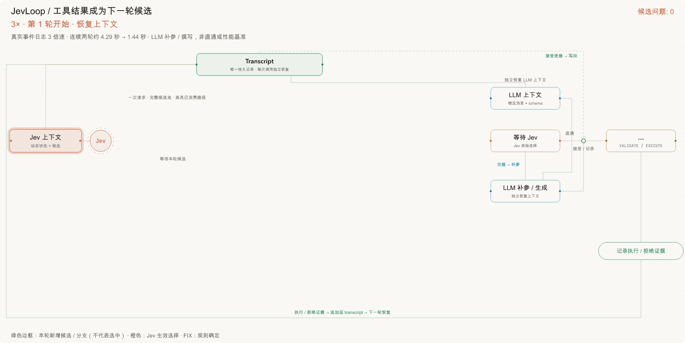
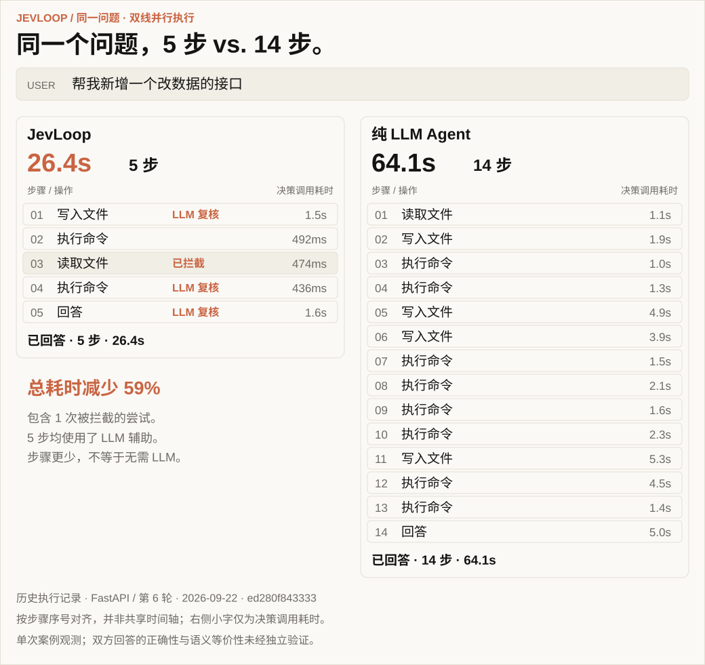
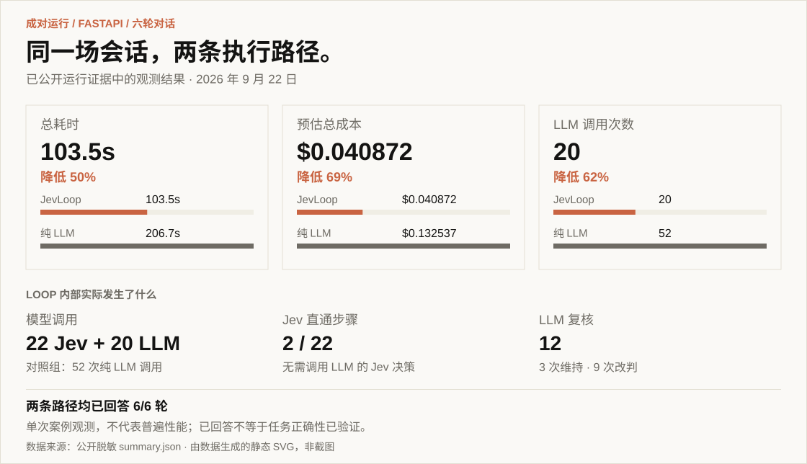

<div align="center">

<!-- HERO_IMAGE_START -->

<!-- HERO_IMAGE_END -->

<p>
  <a href="README.md">English</a> ·
  <a href="README.zh-CN.md">简体中文</a>
</p>

<p>
  <a href="https://www.python.org/"></a>
  <a href="LICENSE"></a>
  <a href="#项目状态"></a>
</p>

</div>

JevLoop 是一个由 [TypeSafe Jev](https://docs.typesafe.ai/introduction)
驱动的开源 Agent Runtime。Jev 负责快速、可校准的工具决策；LLM 仅在需要
自然语言生成或复核低置信决策时介入；确定性代码负责执行、安全、持久化与状态。

```text
观察 → Jev 决策 ──────────────→ 安全审查 → 执行 → 账本 → 循环
              ├─ 需要语言生成 → LLM 撰写 ───────┘
              └─ 低置信度     → LLM 复核 ───────┘
```

最终得到的是一个带有快速路径的传统工具调用 Agent：有限选择无需经过完整 LLM
调用；需要撰写的内容仍由 LLM 基于完整对话 Transcript 生成，并延续供应商的
Prompt Cache。

JevLoop 是独立的开源项目，由 Jev 提供能力，但不是 TypeSafe 官方产品。

## 看见候选集如何随循环演进

控制台将循环直接可视化：从 transcript 恢复上下文，展示 Jev 候选池，
高亮生效选择，按需交给 LLM，再将已接受的调用与执行结果分别追加回 transcript。

<a href="docs/assets/decision-topology-zh-CN.svg"></a>

**工具结果成为后续选择**：第 1 轮写入 `main.py`，第 2 轮就能将它作为 READ_FILE
参数候选，并新增批量选择分支。同一个用户任务中，候选问题从 **8 组扩展到 14 组**。

按 **目的 → 工具 → 参数** 理解候选，不要把每个方框看成依次执行的步骤。
绿色边框标记本轮新增候选或分支，**不代表选中**；橙色为生效选择，灰色为未消费分支，`固` 表示规则唯一确定。
两轮均使用 **LLM 补参或撰写，并非无 LLM 直通**。示例使用真实前端组件与脱敏历史事件生成；
动画按**原始事件日志的 3 倍速**播放（约 4.29 秒 → 1.44 秒，按 GIF 帧取整），
不构成独立的任务成功或性能结论。

[查看可放大的静态 SVG](docs/assets/decision-topology-zh-CN.svg)
· [来源事件、阅读说明与重新生成](docs/assets/README.md#decision-topology-replay)

## 同一个问题，两条 Agent Loop

“帮我新增一个改数据的接口。”这次历史双线运行中，JevLoop 用 **26.4 秒、5 步**
完成回答，纯 LLM Agent 用 **64.1 秒、14 步**。两条路径接收相同请求与执行配置，
工作区和对话账本相互隔离。



原生矢量图由已公开的历史执行记录生成，复用前端配色，没有省略步骤，并非原始截图。
本轮 JevLoop 的 5 步均使用了 LLM 辅助，步骤更少不代表完全不调用 LLM。
这是选取的一轮观测，不代表普遍性能或正确性结论。
[运行证据与渲染说明 →](docs/assets/README.md)

## 一条经过实测的快速路径

> 一次手工驱动的六轮 FastAPI Case。两条 lane 均完成并回答全部 turn；
> 这是一个范围明确的观测结果，不是普遍性能结论。



基于[公开运行数据](docs/evidence/fastapi-6turn-20260922/summary.json)生成，
复用前端面板配色。这是静态数据可视化，不是实时仪表盘。

[完整指标、实验方法、限制、计价与 Run 证据 →](docs/evaluation/fastapi-case-study.md#中文)
· [重新生成面板](docs/assets/README.md#summary-panels)

## 为什么是 JevLoop

传统 Agent Loop 会让通用 LLM 决定每一个步骤，包括“调用哪个工具”“打开哪个
已知资源”这类高频、重复、候选有限的选择。JevLoop 按任务类型拆分职责：

- **Jev 决策**：通过带完整概率分布的类型化问题选择操作和兼容目标；
- **LLM 撰写**：只为命令、查询、消息、文档、文件和最终答案生成文本；
- **LLM 复核**：在同一条追加式 Transcript 上处理低置信度 Jev 决策；
- **Runtime 执行**：统一执行预算、策略、幂等、重复保护和沙箱边界；
- **Ledger 记录**：保存对话、执行证据与恢复事实，Jev 和 LLM 各自从账本生成独立投影。

当 Jev 能直接完成足够多的步骤时，这套架构旨在降低模型延迟与成本。JevLoop
不会宣称所有任务都更便宜：内置的成对实验会明确展示写作密集型与导航密集型
任务的差异，而不是把所有成本隐藏在一个总数里。

## 核心设计

### 一次请求，并行类型化决策

挂载的 `ToolSpec` 会被编译成一次 Jev 请求，其中包含操作问题和推测性目标问题。
工程代码只消费与最终操作兼容的目标 head。概率分布不完整、候选非法或结果与
argmax 不一致时，执行前直接拒绝。

### 一个账本，两种视图

底层 `Transcript` 是唯一事实来源，不等于任一模型的提示词。LLM 读取带单份工具证据的
稳定对话投影；Jev 读取含观察与真实候选的有界 `Workspace`。内部恢复元数据和 Jev
视图不进入 LLM 工具结果。持久化只保存 Transcript；两种视图都可重建，并各自拥有
独立的展示预算。详见[投影契约](docs/contracts/transcript-projection.md)。

### 观察结果成为可选的参数绑定

按目录分页列举、按行读取和有界搜索产生带真实引用的历史观察视图。Jev 可以直接
选择兼容引用及工具声明的默认参数，也始终可以为同一操作选择 `LLM_PARAMETERS`。
部分绑定保持锁定，由 LLM 补齐其余参数；候选构造不机械匹配用户输入。
所有路径共用参数校验和执行策略。详见[观察契约](docs/contracts/observation-views.md)
与[稳定工具契约](docs/contracts/llm-cache.md)。

### 所有 Driver 共用一个 Runtime

`JevDriver` 与 `PlainLlmDriver` 都只向同一个 `RuntimeKernel` 返回 proposal。Driver
不能执行工具、消耗预算或修改状态。Kernel 独占参数物化、安全审查、持久化
intent/effect、工具分发和终止状态。

### 可观测的公平对比

`paired_shadow` 使用相同目标、工具目录、策略、预算和不可变沙箱镜像，同时运行
JevLoop 与纯 LLM Loop。每条 lane 拥有独立的 Transcript、Docker Workspace 和
Prompt Cache 命名空间。指标会分别统计：

- Jev 决策次数、输入 Token 与成本；
- 直接绕过 LLM 的 Jev 步骤；
- LLM 撰写、仲裁和纯 LLM 决策调用；
- 供应商返回的 Cache Hit、Cache Miss 与未知输入；
- 延迟、工具活动、最终结果与总预估成本。

系统不会根据单条 lane 虚构“节省了多少 LLM 成本”；Dashboard 只比较真实执行的
成对结果及其最终状态。


## 成对基准实验

运行固定的多轮场景集：

```bash
make bench
# 或：cd backend && uv run jevloop bench
```

报告写入 `backend/artifacts/bench/<stamp>/report.{json,md}`。Suite 会记录自身摘要、
模型标识、机器校验条件、路由拆分、缓存感知成本、Wall-clock 时间和实际优势。
除非使用 `--no-journal`，运行也会出现在 Dashboard 历史中。

常用选项：

```bash
uv run jevloop bench --list
uv run jevloop bench --only <scenario-id>
uv run jevloop bench --keep-volumes
uv run jevloop bench --no-journal
```

## 执行 Profile

| Profile | Lane | 沙箱副作用 | Lark 写操作 |
| --- | --- | --- | --- |
| `single_shadow` | JevLoop | 执行 | Dry-run |
| `single_live` | JevLoop | 执行 | 通过安全审查后执行 |
| `paired_shadow` | JevLoop + 纯 LLM | 在隔离 Workspace 中执行 | 两条 lane 均为 Dry-run |

系统不提供 paired live write。`max_writes` 是外部副作用的可选紧急上限；沙箱内的
`WRITE_FILE` 与 `BASH` 由 `max_steps` 约束，不计入外部写预算。

## 安全模型

- Docker 容器以非 root 用户运行，移除 capabilities，启用
  `no-new-privileges`，RootFS 只读，并设置资源上限；
- 外部写操作默认拒绝，执行前必须通过置信策略、收件人 Allowlist 与预算；
- 物化后的 intent 在副作用前持久化，执行后记录带明确 disposition 的 effect；
- Bash 源码通过 stdin 进入容器，并在当前命令专属的 Process Group 中运行；
  命令失败仍保留为明确的 `UNKNOWN` 证据，但若命令已结束且沙箱仍可响应，不会
  永久冻结后续 Turn；
- 只有连续相同 intent 获得相同 observation、确认没有进展时，才拒绝再次重复；
- 成对 lane 使用独立 Transcript、Workspace 与供应商缓存命名空间。

当前限制：若运行中断后只留下 `dispatch_started` 而没有 effect，JSONL 审计中会
保留该状态，但暂时不会在重启后自动对账。

## 快速开始

### 环境要求

- Python 3.12+
- [uv](https://docs.astral.sh/uv/)
- Docker
- Dashboard 需要 Node.js 与 pnpm

文件和 Bash 工具只在加固后的容器内执行。宿主机文件系统、凭据、Home 目录、
环境变量和 Socket 都不会挂载到 Agent Workspace。

### 离线 Smoke

Smoke 只需要 Docker，不需要模型 API Key：

```bash
cd backend
uv sync
uv run jevloop smoke
```

成功时会输出包含 `"ok": true` 的 JSON，并真实覆盖共享 Kernel、持久化生命周期、
文件写入/读取、Bash 与容器清理。

### 配置模型

```bash
cd backend
cp env.example .env
# 设置 TYPESAFE_API_KEY 和 DEEPSEEK_API_KEY。
```

如需通过 `VIEW_IMAGE` 理解上传或沙箱中的图片，还需配置 `VISION_MODEL`、
`VISION_MODEL_BASE_URL` 和 `VISION_MODEL_API_KEY`，使用支持图片输入的
Chat Completions 模型。图片作为不可变证据由同一份 transcript 引用，支持历史展示与回放。
Jev 仍根据任务与上下文决定是否读图，包括任务所需的背景图；工具返回视觉观察后，
继续进入原有 Jev 决策循环，不因存在图片而切换整个会话的决策器。
详见[图片配置与限制](backend/README.md#image-inputs)。

改用本地 Laya 做决策时，在本项目的 uv 环境里安装对应 extra，再启动服务。
Apple Silicon 走 MLX，NVIDIA 走 CUDA。设置 `DECISION_PROVIDER=laya` 后，
决策请求会发到这个本地服务。控制台输入框旁也可以直接选 Jev 或 Laya。文本模型不变。

```bash
cd backend
uv sync --extra laya-mlx    # Apple Silicon
uv sync --extra laya-cuda   # NVIDIA
```

`make dev` 会在 `127.0.0.1:8791` 启动这个服务，并让控制台 API 使用它。
`make stop` 会把它和 API、Vite 一起停掉。

可选的飞书/Lark 工具使用当前 `lark-cli` 用户身份：

```bash
lark-cli auth login --domain im,docs
```

### 执行单个目标

```bash
uv run jevloop run \
  "创建 smoke.md，内容为 hello；读取确认后回答 done。"
```

除非显式传入 `--live`，Lark 写操作保持 Dry-run。沙箱文件和 Bash 操作会在隔离
容器中真实执行。普通运行允许容器访问网络；添加 `--offline-sandbox` 可使用确定性
`--network none` 模式。

### 启动 Dashboard

```bash
cd ..
pnpm install
pnpm build:frontend
pnpm serve
# http://127.0.0.1:8790
```

开发模式：

```bash
make dev
```

Dashboard 提供对话、逐步骤模型调用 Trace、Jev-vs-LLM 对比、Session 汇总、
暂停/继续控制和 JSONL 历史回放。回放不会产生新的 API 调用。

## 仓库结构

```text
backend/   Python Runtime、Driver、问题编译器、Ledger、Guardrail、Docker
           沙箱、Lark Adapter、Benchmark Runner 与 Dashboard API
frontend/  React 19 + TypeScript + Vite Dashboard
           对话、成对比较、指标、Session 历史与回放
docs/      当前架构与契约、评测、公开证据及历史归档
```

建议从以下文件开始阅读：

- [`docs/README.md`](docs/README.md) — 文档导航、当前契约、评测记录与归档边界；
- [`docs/backend-layout.md`](docs/backend-layout.md) — 包职责和受检查的依赖方向；
- [`backend/jevloop/runtime/kernel.py`](backend/jevloop/runtime/kernel.py) — 共享 Loop 与执行语义；
- [`backend/jevloop/decision/drivers.py`](backend/jevloop/decision/drivers.py) — Jev 与纯 LLM Driver；
- [`backend/jevloop/decision/model.py`](backend/jevloop/decision/model.py) — Jev Client、问题编译与响应校验；
- [`backend/jevloop/context/transcript.py`](backend/jevloop/context/transcript.py) — 追加式对话账本；
- [`docs/architecture.md`](docs/architecture.md) — 当前架构与实现边界。

## 开发

```bash
# Backend
cd backend
uv sync
uv run pytest
uv run ruff check .

# Frontend
cd ../frontend
pnpm install
pnpm check
pnpm build

# 整个仓库
cd ..
make test
make check
```

## 项目状态

JevLoop 当前处于 Pre-alpha，并在持续开发中。它是对“类型化快速路径 Agent Loop”
的一项启发性实现，目前主要在常规的沙箱文件、Bash 和小型服务维护任务上测试。
仓库中存在可选 Provider Adapter，并不代表已经验证了广泛任务覆盖或生产可用性。
首个稳定版本前，API、事件 Schema、包名和实测行为都可能继续调整。

## 开源协议

项目采用 [Apache License 2.0](LICENSE)。归属信息见 [NOTICE](NOTICE)。

## 致谢

JevLoop 基于 [TypeSafe Jev](https://docs.typesafe.ai/introduction)，并受到
[`browser-use/jev-ultrafast`](https://github.com/browser-use/jev-ultrafast)
所展示的 operation/target speculative fan-out 设计启发。
